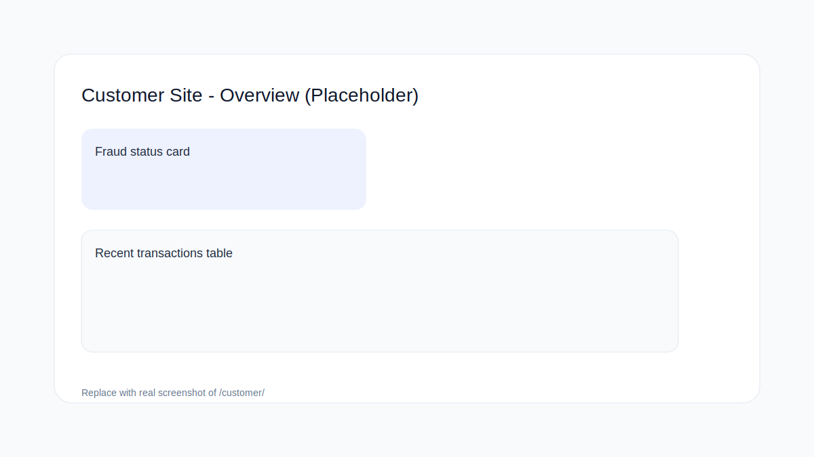
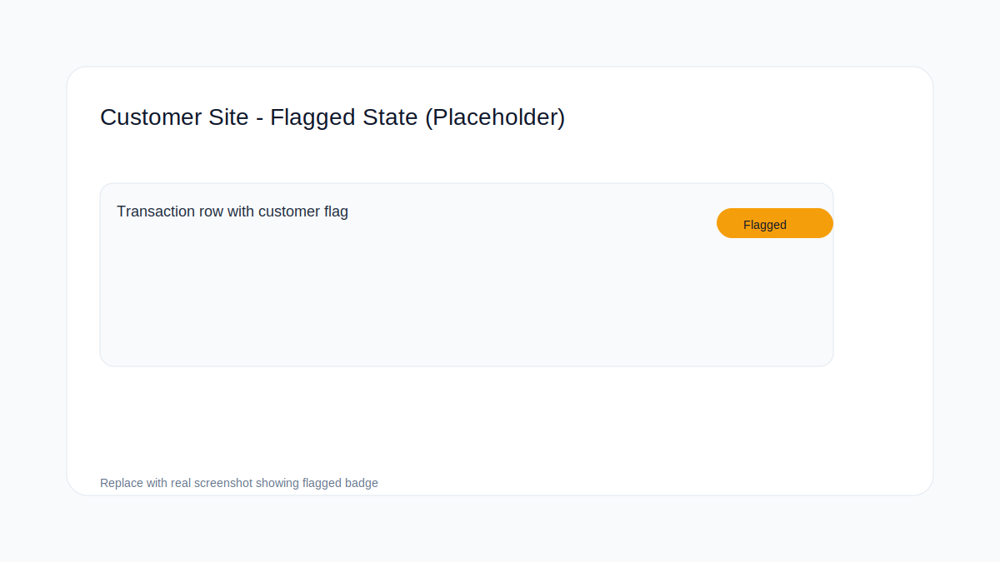

[](https://github.com/AAdewunmi/Neo-Bank-Fraud-Detection-Project/actions/workflows/ci.yml)
[](https://github.com/AAdewunmi/Neo-Bank-Fraud-Detection-Project/actions)
[](https://www.python.org/)
[](https://www.djangoproject.com/)
[](https://www.docker.com/)
[](https://docs.docker.com/compose/)
[](LICENSE)


```markdown
# LedgerGuard (Neo-Bank Fraud Detection Project)

LedgerGuard is a portfolio-grade, production-minded fraud and transaction categorisation prototype for a neo-bank setting. Week 4 closes the loop from model output to operational action: analyst edits become exportable feedback data, business rules can override model categories with audit tags, the app is deployable with a healthcheck, and the repo is packaged for fast recruiter review.

Status: Work in progress (Week 4). This README reflects the current end-to-end system and will continue to evolve as persistence, monitoring, and automated retraining are added.

---

## What exists in Week 4

### Capabilities
- Transaction categorisation baseline (TF IDF with Logistic Regression)
- Fraud risk baseline (Isolation Forest)
- Unified scorer interface (one entry point that returns category, confidence, fraud risk, and flagged status)
- CSV ingestion with schema validation and coercion rules
- Django Ops Dashboard to upload a CSV, view KPIs, filter rows, and inspect scored results
- Feedback loop for analyst category edits, merged in-session and exported as `feedback_edits.csv`
- Stable row identifiers (`row_id`) so feedback is durable across filtering, ordering, and truncation
- Rules overlay (substring match) to override categories with audit tagging (`category_source = rule|model|edit`)
- Preview mode for large uploads (cap rows shown, preserve flagged rows, keep totals)
- Performance page that reads `model_registry.json` and surfaces model metadata and metrics
- Test suite with coverage gate in CI

### Design goals (Week 4)
- Deterministic, reproducible runs where possible (stable tests and diffs in CI)
- Explicit input and output contracts between ingestion, scoring, rules, and UI
- Fail fast, fail informative for bad CSV uploads
- Operational feedback is treated as data, exportable and joinable back to transactions
- Auditability for category provenance (model vs rule vs human edit)

---

## Tech stack (Week 4)
- Python 3.11
- Django 5.x
- pandas, scikit-learn
- pytest, pytest-django, coverage
- Docker, Docker Compose (for container workflow)
- gunicorn (for production serving)

---

## Repository layout (high level)
- `dashboard/` Django app for upload, ingestion services, rendering results, and Ops workflows
- `ml/` training and inference code (baselines, scorer, utilities)
- `tests/` unit and integration-style tests
- `rules/` rule definitions for category overrides
- `docs/` contracts and operational notes (grows over time)
- `artefacts/` trained model artefacts, metrics outputs, and insight assets
- `data/` local sample datasets (not committed if large or sensitive)

---

## Data contract

Expected CSV columns:
- `timestamp`
- `amount`
- `customer_id`
- `merchant`
- `description`

Coercion and rejection rules are documented in `docs/` (policy: reject missing required columns, coerce amount, normalise text fields, require non-empty `customer_id`).

---

## Ops Dashboard workflows (Week 4)

### 1) Upload and score
- Upload a CSV
- Choose a fraud threshold
- View KPIs and a scored preview table

If the upload exceeds the preview limit, the UI shows a truncated table while preserving:
- total transaction count
- total flagged count (from the full dataset)
- a preview that prioritises flagged rows

### 2) Filter results
The Ops Dashboard supports server-side filtering:
- flagged only
- customer_id
- merchant contains
- category contains
- minimum fraud risk

### 3) Category provenance
Rows are audited with a source tag:
- `model` for model output
- `rule` for rule override
- `edit` for analyst override

Precedence is explicit:
- edit wins over rule
- rule wins over model

### 4) Analyst edits and feedback export
Analysts can edit predicted categories inline. Edits are stored by stable `row_id` and merged across multiple submits.

Export:
- Download `feedback_edits.csv` for later retraining and evaluation

Expected feedback columns:
- `row_id`
- `timestamp`
- `customer_id`
- `amount`
- `merchant`
- `description`
- `predicted_category`
- `new_category`
- `edited_at`

---

## Customer site (Week 4)

Purpose:
- A separate, read-only customer experience focused on clarity and minimal data exposure.
- No fraud scores, thresholds, model internals, or Ops controls are shown.

Workflow:
- Visit `/customer/` to review recent transactions and month-to-date spend by category.
- Customers can report a transaction as not theirs with an optional note.
- Customer flags are stored as a separate feedback stream and exported as `customer_flags.csv`.

Screenshots (placeholders):
- 
- 

---

## Rules overlay (Week 4)
Rules live at:
- `rules/category_overrides.json`

Rule format:
- `contains`: substring to match (case-insensitive)
- `category`: category label to apply

Rules apply to:
- `merchant`
- `description`

Rules are designed to be:
- simple, auditable, and fast to change
- explicit about precedence against model output
- easy to test with small fixtures

---

## Local setup

### Prerequisites
- Python 3.11 installed
- Virtualenv available
- Optional: Docker and Docker Compose

### 1) Create a virtualenv and install deps
- Create `.venv`
- Install requirements
- Activate the environment

Use whatever workflow you already follow for this repo.

### 2) Environment variables
This project uses environment variables for configuration.

- Copy `.env.example` to `.env`
- Edit values as needed
- Ensure Postgres is running and `DATABASE_URL` points at it (required for dev and tests)

One reliable way to load `.env` into the current shell session:
- `set -a; source .env; set +a`

Note: If you run Django locally (non-Docker) and you are using Postgres, your DB host typically needs to be `localhost` rather than `db`. If your `.env` points at `db`, that is intended for Docker networking.

---

## Step 1: Run tests (local)
Run the test suite:
- `pytest -q`

Run coverage:
- `coverage run -m pytest -q`
- `coverage report`

CI enforces a minimum coverage threshold. If CI fails, check the coverage report for missing lines and add targeted tests for those branches.

---

## Step 2: Run the app locally (dev server)
Load env vars and start the server:
- `set -a; source .env; set +a; python manage.py runserver`

Open:
- http://127.0.0.1:8000/

Expected behaviour:
- Upload `data/sample_transactions.csv`
- Score the file and render KPIs and a table
- Apply filters to narrow results
- Edit categories inline and see edits persist on refresh
- Export `feedback_edits.csv`
- If a CSV is missing required columns, see a readable error message

---

## Step 3: Healthcheck (Week 4)
A lightweight health endpoint exists for deployment probes:
- `GET /health/` returns `{"ok": true}`

---

## Step 4: Run via Docker

### Quick checks
List service names:
- `docker compose config --services`

### A) Start only Postgres (useful when running Django on host)
- `docker compose up -d db`

If your local Django process connects to Postgres, set host to `localhost` for local runs.

### B) Start the full stack in containers
If you have a web service defined in `docker-compose.yml`:
- `docker compose up -d --build`

Rebuild is important after dependency or code changes inside the image.

View logs:
- `docker compose logs -f`

Stop:
- `docker compose down`

---

## Common gotchas
- Git ignore patterns can accidentally exclude code. If a module is missing in CI, verify with:
  - `git check-ignore -v path/to/file.py`

- Contract mismatch bugs are normal early on: a model can run correctly while the UI fails because expected diagnostic keys or output columns drifted. The project reduces this risk by making contracts explicit and testing them.

- Preview truncation can confuse debugging if you forget it is enabled. Check `LEDGERGUARD_DASHBOARD_MAX_ROWS` and the run metadata for total counts vs preview counts.

---

## Roadmap

### Week 1
- Deterministic baselines
- Unified scoring contract
- Schema-validated ingestion
- Dashboard wiring
- CI hardening and README v1

### Week 2–3
- Model registry and metrics discipline
- Threshold tables and insights artefacts
- Improved UI filters and run metadata
- Training and inference parity improvements

### Week 4
- Feedback loop: edits captured and exported with stable identifiers
- Rules overlay with audit tagging and explicit precedence
- Deployment-ready app with healthcheck and production toggles
- Performance and reliability pass (preview limits, reproducible outputs)
- Recruiter-ready packaging and v1.0 tag

### Future weeks (planned)
- Persistence (Postgres models, audit logs, user accounts)
- Monitoring and metrics (ingestion failures, scoring drift)
- Background jobs (Celery/Redis) where appropriate
- Automated retraining pipeline fed by exported feedback

---

## Maintainer
Adrian Adewunmi

## Repository
https://github.com/AAdewunmi/Neo-Bank-Fraud-Detection-Project
```
